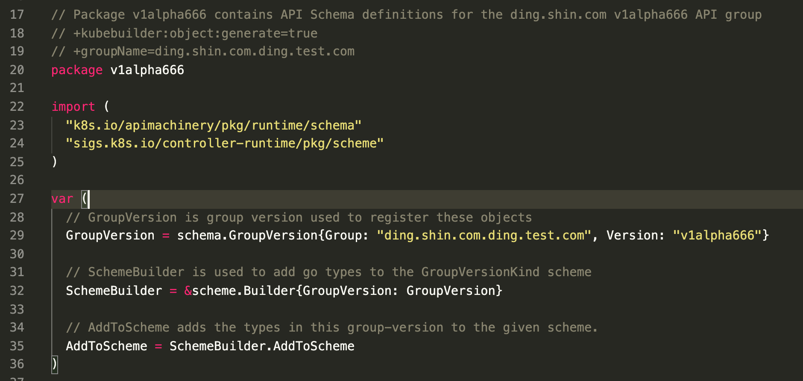
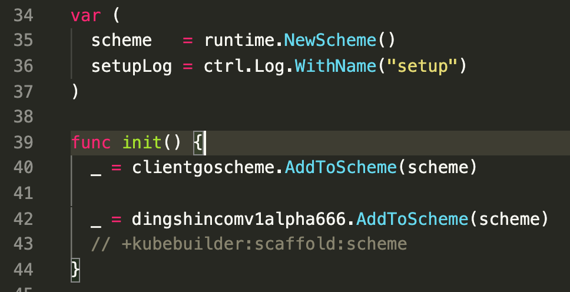

# Kubebuilder笔记

-----

## kubebuilder 作用
- 提供脚手架工具初始化 CRDs 工程，自动生成 boilerplate 代码和配置
- 提供代码库封装底层的 K8s go-client

## kubebuilder整体流程


1. 用户自定义crd，将自定义的crd注册到scheme中，这样通过GVK能找到对应的go的struct，也能通过go的struct找对对应的GVK
2. Cache监听Scheme中的GVK，同时和Api Server简历list-watch的连接
3. 当发现某个controller需要的GVK资源发生状态的改变就reconcile调度对应的controller
4. 对应的controller中是用户自己定义的逻辑，用来保证该类型的crd和k8s集群中声明的该资源的yaml/json中的字段一致
5. 保证一致主要是通过调用Clients，然后Clients可以和Api Server交互


## 使用方法
1. 初始化脚手架
这不创建了一个项目模板并引入一些依赖
```bash
kubebuilder init --domain ding.test.com
```
2. 创建api
会在根目录下创建一个api目录
里头有:
resourcename_types.go、groupversion_info.go、
zz_generated.deepcopy.go

```bash
kubebuilder create api --group ding.shin.com --version v1alpha666 --kind DingShinType
```
groupversion_info.go: 会声明 GroupVersion、SchemeBuilder、AddToScheme三个东西(也可以手动给改到别的文件引入)

每当再执行一遍craete api 如:
```bash
kubebuilder create api --group ding.shin.com --version v1alpha666 --kind DingShin888Type
```
就会多生成一个xxxxx_type.go</br>
不同的自定义CRD需要调用 SchemeBuilder.Register 注册自己以及一个 list</br>
之后在程序入口要将自定义的 CRD 们添加到 build-in(原生k8s的资源) 资源里面，
这样Cache就知道应该去Watch谁了</br>
在程序的入口处，除了把自定义的 CRD 添加到 scheme 中，还需要使用 manager 初始化资源，如:
```go
  // 1、init Manager
	mgr, err := ctrl.NewManager(ctrl.GetConfigOrDie(), ctrl.Options{Scheme: scheme, MetricsBindAddress: metricsAddr})
	if err != nil {
		setupLog.Error(err, "unable to start manager")
		os.Exit(1)
	}
```
```go
  // 2、init Reconciler（Controller）
  // 主要吧Clien Log Scheme 等依赖传进去
	err = (&controllers.ApplicationReconciler{
		Client: mgr.GetClient(),
		Log:    ctrl.Log.WithName("controllers").WithName("Application"),
		Scheme: mgr.GetScheme(),
	}).SetupWithManager(mgr)
	if err != nil {
		setupLog.Error(err, "unable to create controller", "controller", "EDASApplication")
		os.Exit(1)
  }
  
  // 3、调用 SetupWithManager 方法初始化Reconciler
  func (r *DingShin888TypeReconciler) SetupWithManager(mgr ctrl.Manager) error {
    return ctrl.NewControllerManagedBy(mgr).
      For(&dingshincomv1alpha666.DingShin888Type{}).
      Complete(r)
  }
```
也可以自定义setup方法去初始化，如:
```go
func VolumeMounterSetup(mgr ctrl.Manager, l logr.Logger) error {
	name := "sage/" + strings.ToLower(sagecorev1alpha2.VolumeMounterTraitGroupKind)
	return ctrl.NewControllerManagedBy(mgr).
		Named(name).
		For(&sagecorev1alpha2.VolumeMounterTrait{}).
		Complete(
		NewVolumeMounterTraitReconciler(mgr,
				core.WithLogger(l.WithValues("controller", name)),
				core.WithRecorder(event.NewAPIRecorder(mgr.GetEventRecorderFor(name)))))
}

// 里面主要得把 Scheme 以及 Client 和 Record 都传进去
func NewVolumeMounterTraitReconciler(m ctrl.Manager, o ...core.ReconcilerOption) *VolumeMounterTraitReconciler {
	it := &VolumeMounterTraitReconciler{}
	it.Client = m.GetClient()
	it.Scheme = m.GetScheme()
	it.Record = event.NewNopRecorder()
	for _, ro := range o {
		ro(&it.Reconciler)
	}
	it.traitBuilder = sagetrait.NewVolumeMounterTraitBuilder(it.Client, it.Log)
	gc := sagegc.GarbageCollector{
		Client: m.GetClient(),
		Log:    it.Log,
	}
	it.GC = gc

	return it
}
```


同时在 zz_generated.deepcopy.go 文件中也会对新的api创建对应的 deepcopy 相关的函数(对runtime.Object的interface的实现)</br>
另外 config 目录下的 crd 目录下的 yaml 们是对要创建的crd资源的描述</br>
controllers 目录下是 自定义的 Kind 的 controller


## 启动自定义 CRD 以及 Controller 的大概流程
1. 首先入口处 NewManager, NewManager 内部大概就是 NewClient 以及 NewCache
```go
	mgr, err := ctrl.NewManager(cfg, ctrl.Options{SyncPeriod: &options.SyncPeriod, MetricsBindAddress: options.MetricsAddr})
```
2. 其中 NewCache 大概就是 new 了一个 informer 的 map，然后这个 map 以每个Kind，也就是每个 GVK 为 key，value 是它对应的 informer，每个 informer 都会创建一条 List Watch 和 Api Server 通信，监听对应的 Kind(GVK)
3. NewClient 就是创建了一个用于和 Api Server 通信的客户端，其中读操作直接去 Cache 中去读，写的话会间接调用 k8s 提供的 go-client
4. 然后把自定义的 CRD 注册给scheme
先:
```go
  // groupversion_info.go 下
  var (
    GroupVersion = schema.GroupVersion{Group: GROUP, Version: VERSION}
  )
```
然后:
```go
  // 可以在同一个package下调用它的 Register
  SchemeBuilder.Register(&ServerWorkload{}, &ServerWorkloadList{})
	SchemeBuilder.Register(&TaskWorkload{}, &TaskWorkloadList{})
  // ......其他 CRD
```
再:
```go
  // 引入 SchemeBuilder 所在的那个 package
  import alpha666 "xxxxxx/yyyyyy/xxxxx"
  // 以及 client-go 提供的 schema，也就是哪些 build-in 的资源类型
  buildInScheme "k8s.io/client-go/kubernetes/scheme"
  scheme = runtime.NewScheme()
  _ = buildInScheme.AddToScheme(scheme)
	_ = alpha666.AddToScheme(scheme)

------------------------------------------------------------------

  // or:
  import (
    // 引入 runtime
    "k8s.io/apimachinery/pkg/runtime"
    // 引入 SchemeBuilder 所在的那个 package
    v1alpha1666 "xxxxxx/yyyyyy/xxxxx"
  )
  AddToSchemes = append(runtime.SchemeBuilder, v1alpha1666.SchemeBuilder.AddToScheme)
  
  mgr, err := ctrl.NewManager(cfg, ctrl.Options{SyncPeriod: &options.SyncPeriod, MetricsBindAddress: options.MetricsAddr})

  s := mgr.GetScheme()
  AddToSchemes.AddToScheme(s)
```
5. 直到调用完 AddToScheme 才算是这个 CRD(CRDS) 被注册完事儿
6. 之后需要需要对所有的 CRD 进行Setup
```go
func Setup(mgr ctrl.Manager, l logr.Logger) error {
	for _, setup := range []func(ctrl.Manager, logr.Logger) error{
    // ...
    corecontroller.ServerSetup,
    // ...
	} {
		if err := setup(mgr, l); err != nil {
			return err
		}
	}
	return nil
}
```
```go
// 可以和 Reconcile 定义在一起
func ServerSetup(mgr ctrl.Manager, l logr.Logger) error {
	// ...
	return ctrl.NewControllerManagedBy(mgr).
		Named(name).
		For(&corev1alpha2.ServerWorkload{}).
		Complete(NewServerWorkloadReconciler(mgr,
			sagecore.WithLogger(l.WithValues("controller", name)),
			sagecore.WithRecorder(event.NewAPIRecorder(mgr.GetEventRecorderFor(name)))))
}
```
```go
func NewServerWorkloadReconciler(m ctrl.Manager, o ...sagecore.ReconcilerOption) *ServerWorkloadReconciler {
	sr := &ServerWorkloadReconciler{}
	sr.Client = m.GetClient()
	sr.Scheme = m.GetScheme()
	sr.WorkloadRender = sagerender.SageRender{}
  sr.Record = event.NewNopRecorder()
	proxy := &sageproxy.ApplicatorProxy{
		Client: m.GetClient(),
		Scheme: m.GetScheme(),
		Log:    sr.Log,
	}
	sr.Proxy = proxy
  // 还可以处理一些GC 相关
	return sr
}

```
7. 在 ctrl.NewControllerManagedBy 之后总会调用 complete 方法
8. complete 内部大概逻辑是，doController 方法，初始化一个 Controller，
这个 Controller 有 Cache 负责注册 Watch，Client 负责Kind 的 CUD 没有R，Queue 负责对 Watch 到的资源的事件做缓存，Recorder 负责事件收集，还有重要的 Do 这个就是自己写的那个 Reconcile 方法。
9. 之后内部还会触发一个 doWatch 方法，该方法里头初始化了一个 handler，然后调用上面初始化的 Controller 的 Watch 方法，但是
这个 Watch 不是真的开始监听，而是先初始化该类型的 CRD 的 Watch，包括把 handler，src源，queue 等传进去
10. complete 到这儿基本就算是完事儿了，之后调用 manager.Start 方法
```go
return errors.Wrap(mgr.Start(ctrl.SetupSignalHandler()), "can not start controllers")
```
11. 这个方法中，主要逻辑就是启动 Cache 以及 Controller
12. 启动 Cache 的话，是去找第2步中的那个 informerMap，
然后把每一个 informer 都run起来，run起来就算是真正开始和 Api Server 建立 List Watch 链接开始监听该 Kind 的 GVK 了
13. 每当 Api Server 给发送资源改变的消息之后，会触发对应的第7步中的 handler，handler 中一共有 delete，create，update 三个方法，但是这三种方法干的事儿都是一样的，就是单纯地将对应的资源的 name 和所在的 namespace 放入 queue中（具体到底是 CUR 哪个操作需要在 Reconcile 中自己判断）
14. 最后启动 Controller，Controller 中会启动一个 goroutine 的协程不停地查询 queue，如果 queue 中还有东西的话，就 Get 出来，然后会调用该 controller 上的 Do(第5步) 上的 Reconcile 方法，这个方法就是真正自己定义的那个 Reconcile
15. 注意，每个 CRD 都有自己的一个 controller，因为在注册每个 CRD 的时候都会调用 complete 方法，doController 就是在这个 complete 中初始化的
